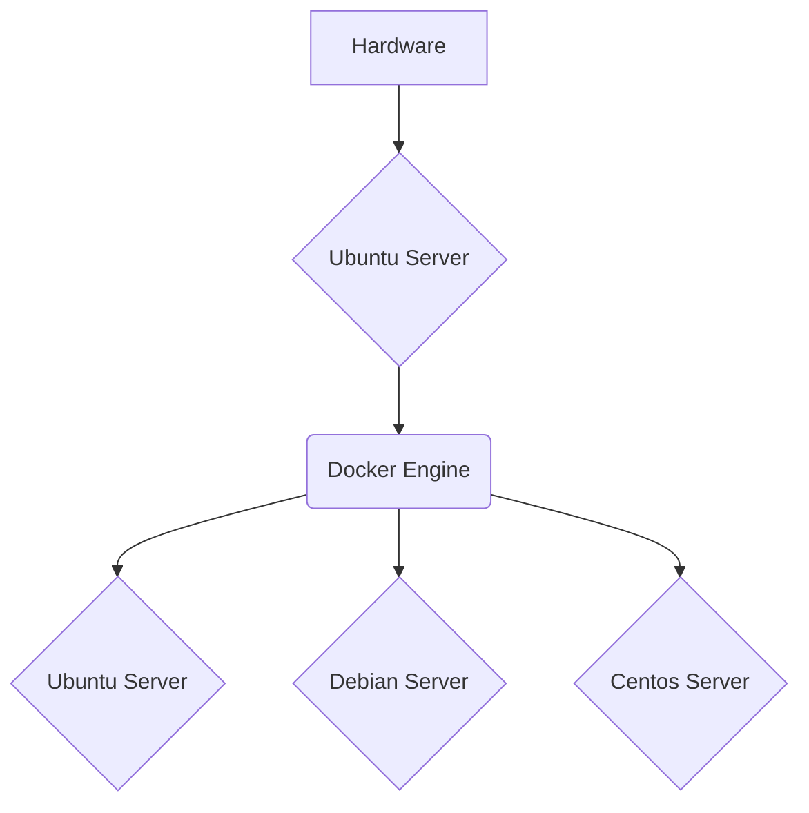

## Introduction

Before VMs, every server only had one operating system. This means if you wanted a windows server and linux server. You needed two physical servers. Here comes virtualization, instead of installing an OS you install a hypervisor (VMware ESXi). This allows you to divide your server resources into multiple servers running different OS.

### Hypervisor Flow

```mermaid
<Mermaid name="diagram">
flowchart TD
    A[Hardware] --> B(Hypervisor)
    B --> D{Windows Server}
    B --> E{Ubuntu Server}
    B --> F{Debian Server}
</Mermaid>
```

Well why use Docker to run different OS on your server if hypervisors do that already? Well, virtualization and virtual machines virtualize hardware. Docker visualizes the operating system.

### Docker Flow



The docker containers contain the OS that we need to run. These are micro containers that contain their own OS, CPU, Memory and Network. These are lightweight, fast and **isolated**.

### Why is it so fast?

Since we are building our docker engine on top of our linux server. We only need one kernel. All Docker containers use the same kernel. As opposed to, hypervisors which contain their own kernels.

### How is the industry using Docker?

Developers can write their code. Deploy it in a docker container, and it works anywhere.

### Microservices

Take portions of your stack and segmenting it into smaller bits and pieces. Split your app server, app client and database in separate containers.

## Dockers in Node

Dockerfile is a blueprint for building a Docker Image

A Docker Image is a template for running Docker Containers.

A Container is just a running process.

1. Developer creating the software defines the environment with the dockerfile.
2. Another developer can use the docker file to rebuild the environment which is saved as an image. Images can be shared and anyone can pull that image.
3. The image can be run in a docker container

### Creating a Dockerfile that Creates Docker Image

```js
//In src/index.js

const app = require ("express")() ;
app.get ('/', (req, res ) =>
    res.json({ message: 'Docker is easy!' })
);
const port = process.env.PORT || 8080;

app.listen(port, () => console. log(`app listening on http://localhost:${port}`))
```

Create Docker Ignore and add node_modules

```Docker
#In Dockerfile

# From Node Image
FROM node:12

# Set directory
WORKDIR /app

#Install dependencies first so they can be cached

COPY package*.json ./

RUN npm install

# Copy source code 
COPY . .

# Set Port
ENV PORT=8080

EXPOSE 8080

#Run
CMD["npm", "start"]
```

### Create Docker Image

```bash
docker build -t username/app:1.0 . 
```

The period is the path. When the process is done. It returns "successfully built image_id"

Next you can push this to the cloud for others to use. For now we are gonna, run the docker locally.

### Create container

```bash
docker run image_id

docker run -p 5000:8080

```

### Volume: share data between containers

```bash
#Create volume
docker volume create shared-data-folder
#mount volume
docker run \
> --mount source=shared-data-folder,target=/data-folder
```

### Docker Compose: In Progress

## Command Cheat Sheet

```bash

#create new docker container w
docker run -d -t --name container_name centos/ubuntu/node

#show all containers in server
docker ps

#show resources for all containers
docker stats
```
